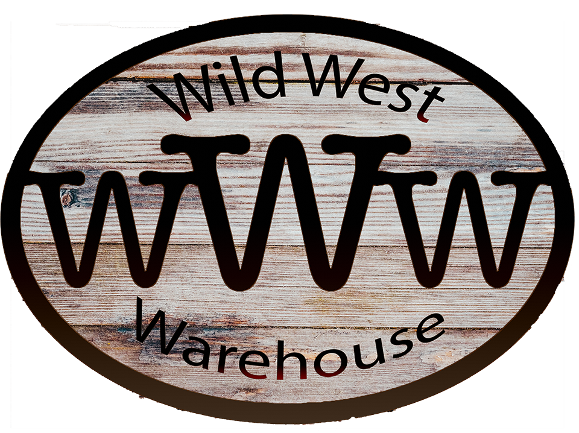

# Wild West Warehouse

## The E-Commerce site for all your cowboy needs.

### Made by: Andy Fiedler, Steven Jones, Ian Smith, and Jon Struve.

This react driven application is the best place to find all your cowboy needs, because it's all priced just like the 1850s.
 If there's anything we don't have, that you might need for your ranger duties, or you have general feedback you want to present, you can contact us [here](mailto:wwwshop@gmail.com).

Our website uses a back-end API to run all of it's routes, as well using MongoDB to store all of our products and users.
 The entire back-end is run through Express and NodeJS, while the front-end uses superagent to reference different routes made on the backend.

You can find the back-end repository [here](https://github.com/WWWStore/WWW), as well as the front-end application, run through Netlify, [here](https://wild-west-warehouse.netlify.com).

#### Check out the team!

Name | LinkedIn | Github
---- | -------- | ------
Andy Fiedler | [/andy-fiedler](https://www.linkedin.com/in/andy-fiedler/) | [/AndyFiedler](https://github.com/AndyFiedler)
Steven Jones | [/colosrjones](https://www.linkedin.com/in/colosrjones/) | [/ColoSRJones](https://github.com/ColoSRJones)
Ian Smith | [/ian-smith](https://www.linkedin.com/in/ian-smith-50a518181/) | [/ismith3](https://github.com/ismith3)
Jon Struve | [/jon-struve](https://www.linkedin.com/in/jon-struve-865543189/) | [/OCDAmmo3](https://github.com/OCDAmmo3)

